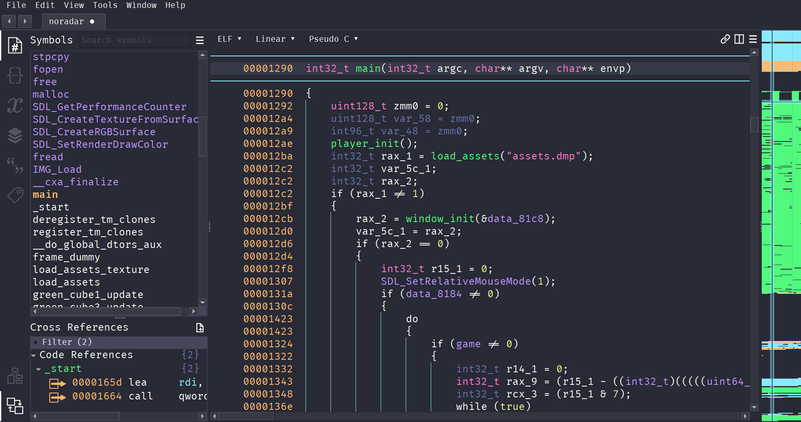
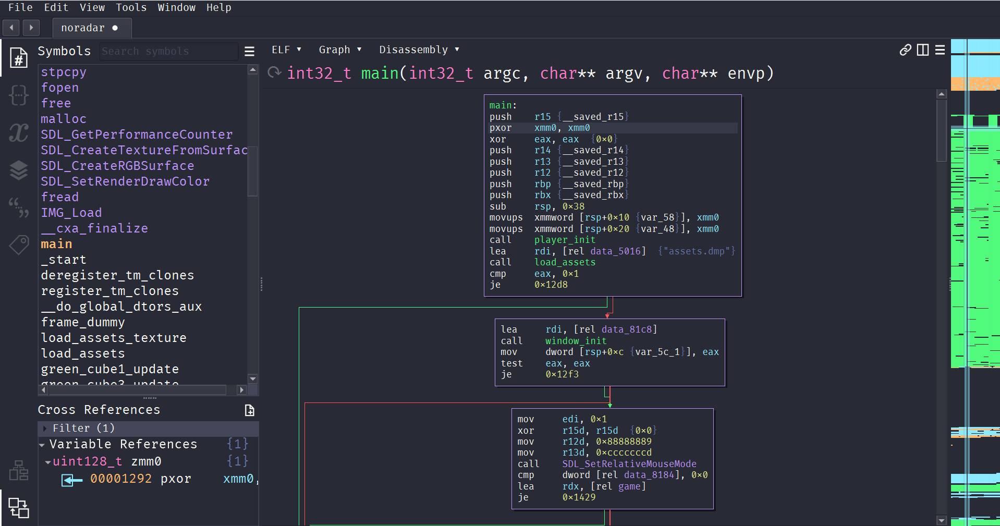

# Dracula for [Binary Ninja](https://binary.ninja/)

> A dark theme for [Binary Ninja](https://binary.ninja/).

## Install

1. Download the `theme/Dracula.bntheme` file.
2. Move the `Dracula.bntheme` file to the `themes` subdirectory in your [user folder](https://docs.binary.ninja/guide/index.html#user-folder) (you might need to create the `themes` subdirectory if it doesn't exist).
3. Open Binary Ninja and go to `Edit > Preferences > Settings`
4. Search for `Theme` and select `Dracula` from the dropdown.
5. Enjoy!

## Team

This theme is maintained by the following person(s).

|       |
| ------------------------------------------------------------------------------------------ |
| [CX330's GitHub](https://github.com/CX330Blake) [CX330's Blog](https://blog.cx330.tw) |

## Community

- [Twitter](https://twitter.com/draculatheme) - Best for getting updates about themes and new stuff.
- [GitHub](https://github.com/dracula/dracula-theme/discussions) - Best for asking questions and discussing issues.
- [Discord](https://draculatheme.com/discord-invite) - Best for hanging out with the community.

## Dracula PRO

## License

[MIT License](./LICENSE)
